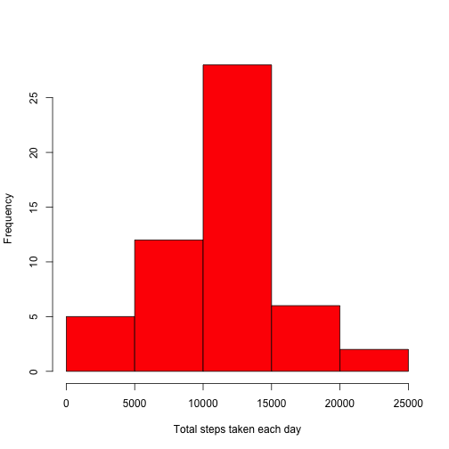
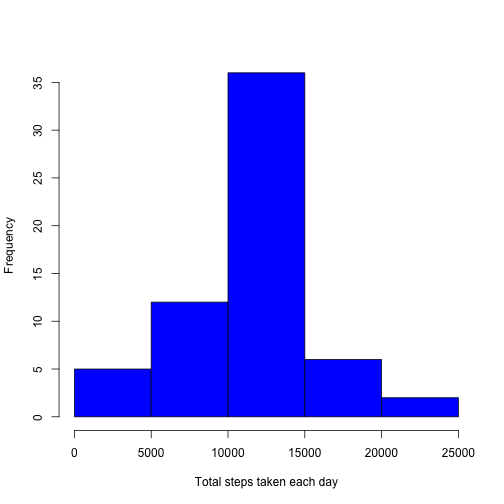
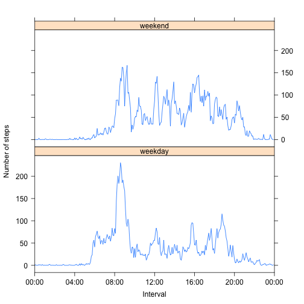

## Loading and preprocessing the data
As said in the assignment, we don't need to download the data. We do however
check if the file that we expect to see i.e. activity.csv has already been 
unzipped; if not we do so prior to passing the csv file to fread() to create
a data table. 


```r
require(data.table)
require(plyr)
require(lubridate)
require(lattice)

localName <- "activity.csv"
# Check if the file has already been unzipped
if (!file.exists(localName)) {
    localZipName <- "activity.zip"
    unzip(localZipName, overwrite = FALSE)
}
dt <- fread(localName)
```


## What is mean total number of steps taken per day?
The following histogram shows the total number of steps taken each day:

```r
# Compute the total number of steps taken each day
stepsPerDay <- ddply(dt, .(date), summarise, total = sum(steps, na.rm = FALSE))
hist(stepsPerDay$total, col = "red", 
     xlab = "Total steps taken each day", main = "")
```

 

```r
meanStepsPerDay <- round(mean(stepsPerDay$total, na.rm = TRUE))
medianStepsPerDay <- round(median(stepsPerDay$total, na.rm = TRUE))
```
**Summary statistics for the total number of steps taken per day:**  
Mean:   10766    
Median: 10765  


## What is the average daily activity pattern?
The following chart shows the average number of steps taken per time interval
of the day, averaged acros all the dates in the data set.

```r
# Compute the mean per interval over all the days
avgDailyActivity <- ddply(dt, .(interval), summarise, 
                          avg = mean(steps, na.rm = TRUE))
# Add a proper time column to avoid the {x}55 -> {x+1}00 jumps e.g. 155->200
# when the hour switches
avgDailyActivity$time <- seq.POSIXt(along.with = avgDailyActivity$interval, 
                                    from = as.POSIXct("2012-10-01"), 
                                    by = "5 min")
# Plot the line plot
with(avgDailyActivity, plot(x = time,
                            y = avg,
                            type = "l",
                            col = "black",
                            ylab = "Average number of steps",
                            xlab = "Time of day",
                            main = "Daily activity",
                            axes = FALSE))  # don't draw axes yet
axis(2) # Plot y axis
# The default labels for date time are no good as they don't start at 00:00.
# Therefore we create our own sequence going from 00:00 to the next day 00:00
# in steps of 4 hours which is a total of 7 label values:
xLabels <- seq(from = avgDailyActivity[1,"time"],
                                by = "4 hours", 
                                length.out = 7)
axis(1, labels = format(xLabels, "%H:%M"), at = xLabels)
box() # box around the plot
```

 

```r
# Compute the interval with the max number of steps:
idx <- which(avgDailyActivity$avg == max(avgDailyActivity$avg))
maxIntervalLeft <- format(avgDailyActivity$time[idx], "%H:%M")
maxIntervalRight <- format(avgDailyActivity$time[idx+1], "%H:%M")
```
The 5-minute interval which, on average across all the days in the dataset,
contains the maximum number of steps is between 08:35 inclusive
and 08:40 exclusive, or in mathematical terms 
[08:35, 08:40).


## Imputing missing values
The total number of missing values in the dataset (i.e. the total number of 
rows with NAs) can be computed as follows:

```r
sum(is.na(dt$steps))
```

```
## [1] 2304
```

However, this does not tell us much. We can easily show that the NAs only 
occur for a whole day at once, so either we have a full day of data, or a full
day of missing data. The dates for which we have no data at all are:

```r
missingData <- ddply(dt, .(date), summarise, cnt = sum(is.na(steps)))
missingData[missingData$cnt != 0, ]
```

```
##          date cnt
## 1  2012-10-01 288
## 8  2012-10-08 288
## 32 2012-11-01 288
## 35 2012-11-04 288
## 40 2012-11-09 288
## 41 2012-11-10 288
## 45 2012-11-14 288
## 61 2012-11-30 288
```

Our strategy for filling in the missing values on the days where data is 
missing is to use the mean of the 5-minute interval calculated earlier. 

```r
# Create a new data set with completed data (abbreviated as cd)
cd <- dt
# Fix the steps. What happens here is that if steps is not NA, we just use
# the value of steps. If it is NA, we lookup the avg value in the previously
# computed avgDailyActivity that has the same interval as the one in cd. 
# Quite powerful what you can do in a single sentence in R...
cd <- ddply(cd, .(date), mutate, 
            steps = ifelse(!is.na(steps), 
                           steps, 
                           avgDailyActivity[avgDailyActivity$interval
                                            == interval ,"avg"]))
# Convert back to data.table (line would be too long above if I do this in
# one go)
cd <- data.table(cd)
setkey(cd, date)
```

After imputing the missing values, the histogram of the total number of steps
taken each day becomes:

```r
# Compute the total number of steps taken each day
stepsPerDay2 <- ddply(cd, .(date), summarise, total = sum(steps))
hist(stepsPerDay2$total, col = "blue", 
     xlab = "Total steps taken each day", main = "")
```

 

```r
meanStepsPerDay2 <- round(mean(stepsPerDay2$total))
medianStepsPerDay2 <- round(median(stepsPerDay2$total))
```
**Summary statistics for the total number of steps taken per day:**  
Mean:   10766    
Median: 10766  

The median has changed slightly, and the mean is unchanged versus the original
data set with missing data. The histogram looks the same. So we can conclude 
that the impact of imputing missing data on the estimates of the total daily 
number of steps has been negligible.

## Are there differences in activity patterns between weekdays and weekends?
The activity pattern between weekdays and weekends is quite different, as shown
by the following graphs:

```r
# Add a factor variable dayType to indicate weekend or weekday
cd[, dayType := factor(ifelse(weekdays(as.Date(date), abbreviate = TRUE) 
                              %in% c("Sat", "Sun"), 
                              "weekend",    # if true 
                              "weekday"))]  # if false
```

```
##            steps       date interval dayType
##     1: 1.7169811 2012-10-01        0 weekday
##     2: 0.3396226 2012-10-01        5 weekday
##     3: 0.1320755 2012-10-01       10 weekday
##     4: 0.1509434 2012-10-01       15 weekday
##     5: 0.0754717 2012-10-01       20 weekday
##    ---                                      
## 17564: 4.6981132 2012-11-30     2335 weekday
## 17565: 3.3018868 2012-11-30     2340 weekday
## 17566: 0.6415094 2012-11-30     2345 weekday
## 17567: 0.2264151 2012-11-30     2350 weekday
## 17568: 1.0754717 2012-11-30     2355 weekday
```

```r
# Create a summary table for the activity by computing the mean per 
# interval and per weekday type over all the days. 
setkey(cd, interval, dayType)
weekActivity <- ddply(cd, .(interval, dayType), summarise, 
                      avg = mean(steps))
# Add a proper time column to avoid the {x}55 -> {x+1}00 jumps e.g. 155->200
# when the hour switches. Note that the weekActivity contains alternating
# values of dayType for each interval (due to the key set above), so we must
# repeate each time value 2 times hence the rep(..., each = 2)
weekActivity$time <- rep(seq.POSIXt(length.out = 24 * 12, 
                                    from = as.POSIXct("2012-10-01"), 
                                    by = "5 min"),
                         each = 2)
# To create the panel plot, we use the lattice system
xyplot(avg ~ time | dayType, type = "l", layout = c(1, 2), data = weekActivity, 
       # Formatting options: 
       xlab = "Interval", ylab = "Number of steps", 
       # By setting xlim we avoid the empty space left and right so the line
       # and the labels start and end at the borders of the plot area
       xlim = c(xLabels[1], xLabels[7]), 
       # This formats the x axis scale; for y use y = list(...)
       scales = list(cex = 1, 
                     x = list(at = xLabels, labels = format(xLabels, "%H:%M")))
       ) 
```

 


During week days, the activity is highest in the morning when people go to
work, around noon when they go for lunch, and then peaks again when work is 
finished and they go home.

During the weekend, we can see a similar pattern in the morning, but the peaks
are more evenly distributed during the day, and more pronounced in the
afternoon compared to weekdays.
